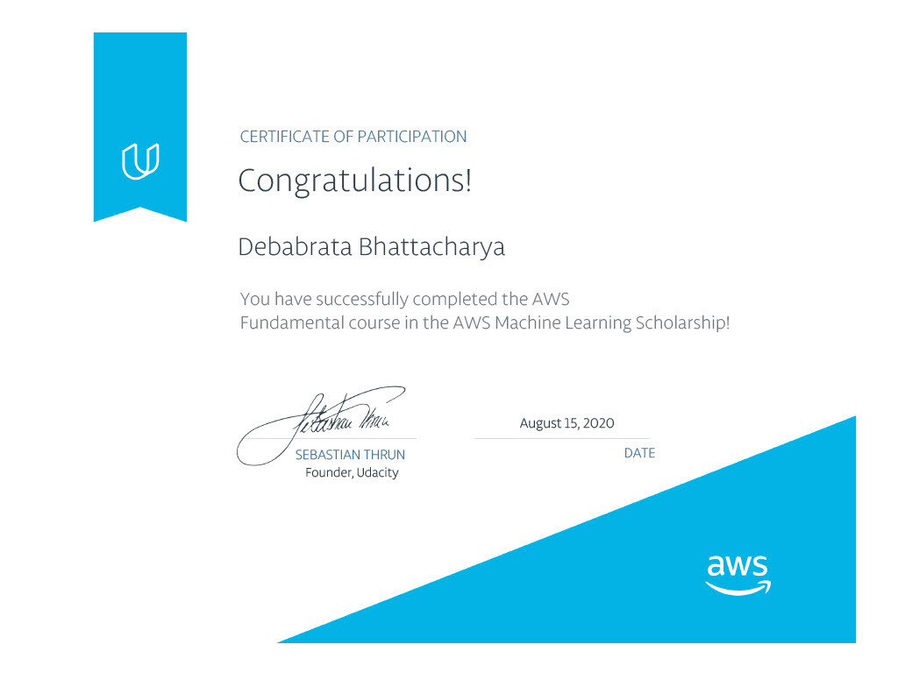
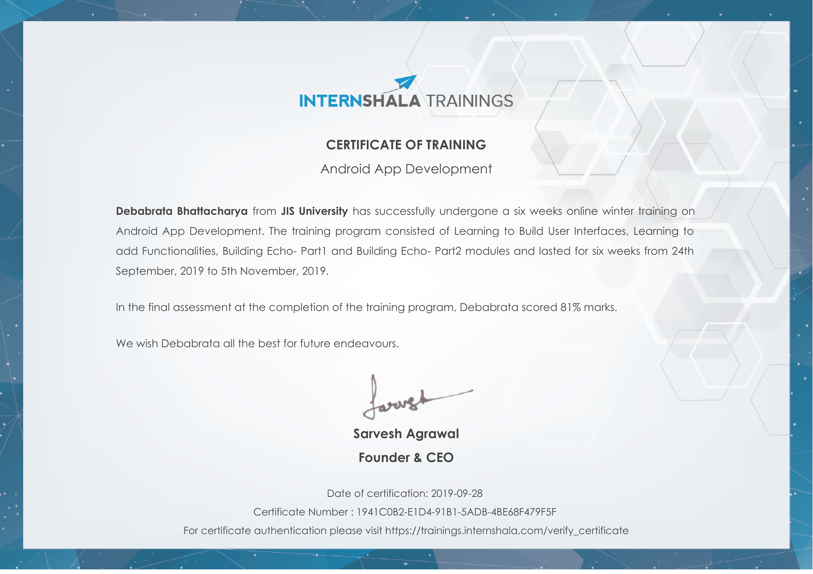
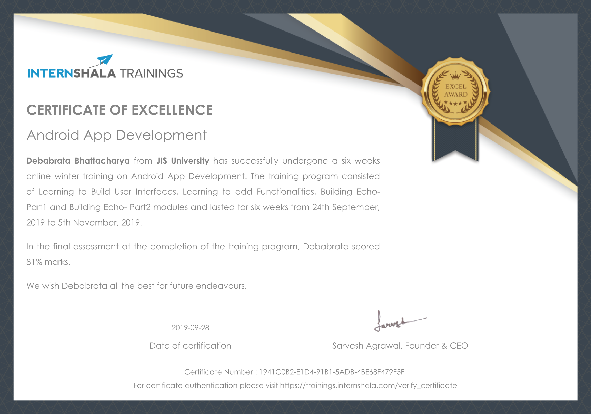
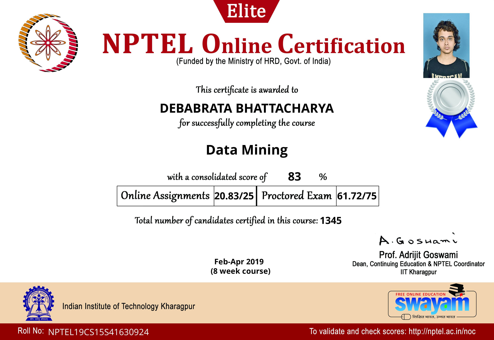
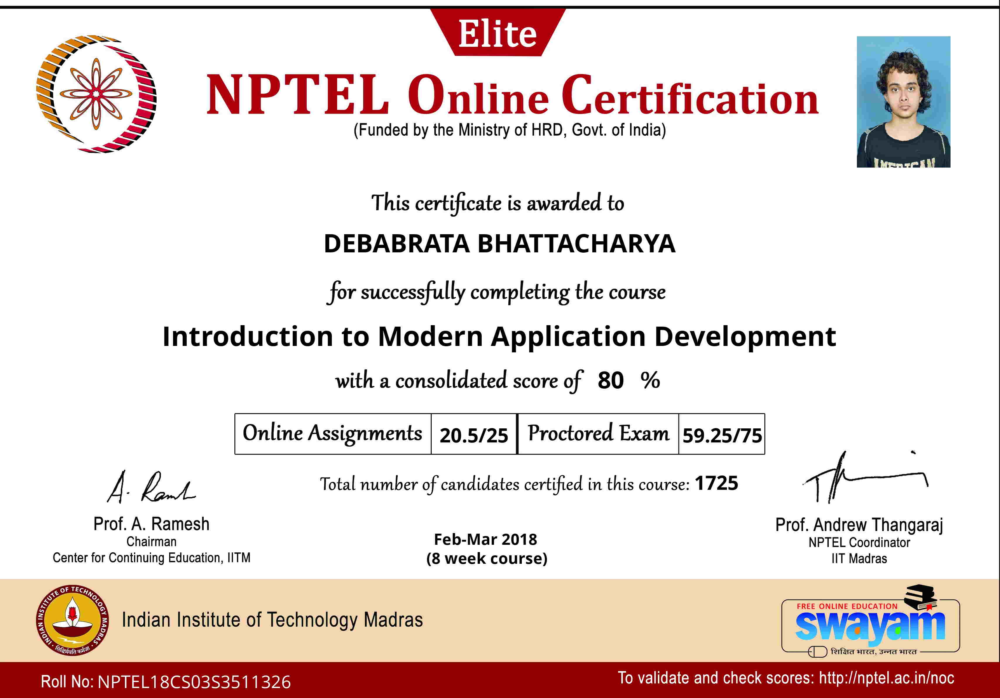
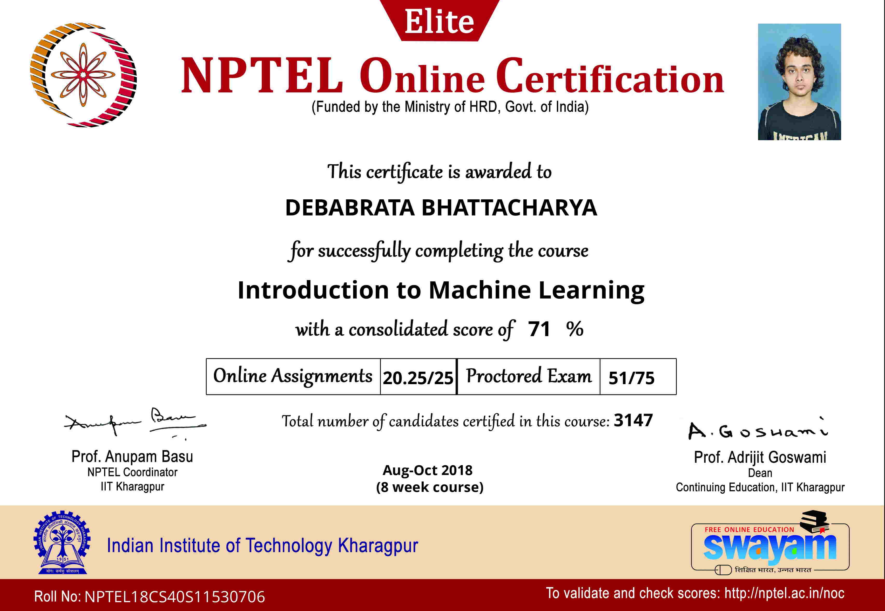
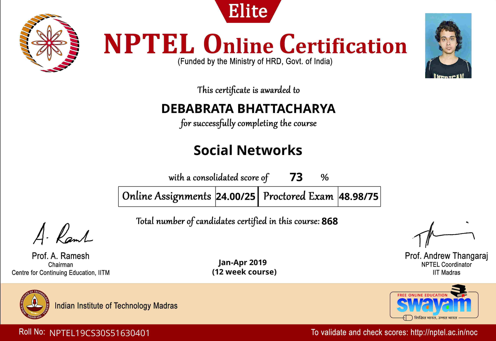
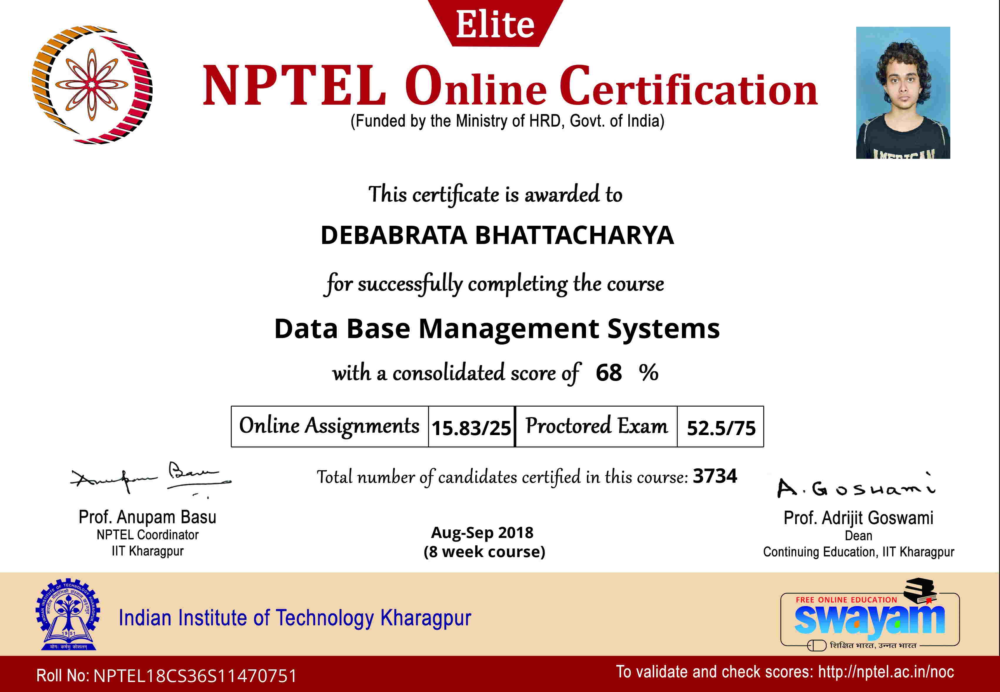

# Certifications

## Summary

This page displays information about the various certifications I have. Here's a link to my [portfolio page](index.html).

## Sections

- [Certifications](#certifications)
  - [Summary](#summary)
  - [Sections](#sections)
  - [Udacity](#udacity)
    - [AWS Machine Learning Scholarship](#aws-machine-learning-scholarship)
  - [InternShala](#internshala)
    - [Android App Development](#android-app-development)
  - [NPTEL](#nptel)
    - [Data Mining](#data-mining)
    - [Introduction to Modern Application Development](#introduction-to-modern-application-development)
    - [Introduction to Machine Learning](#introduction-to-machine-learning)
    - [Social Networks](#social-networks)
    - [Data Base Management Systems](#data-base-management-systems)

## Udacity

### AWS Machine Learning Scholarship

- Received for completing the course for AWS Machine Learning Scholarship

## InternShala

### Android App Development

- Received for completing the course for Android App Development

- Received for excellence in the course for Android App Development

## NPTEL

### Data Mining

- Recieved for excellence in the Data Mining course
- Awarded Silver Medal

### Introduction to Modern Application Development

- Recieved for excellence in the IMAD course
- Awarded Elite status for excellence

### Introduction to Machine Learning

- Recieved for excellence in the Intro to Machine Learning course
- Awarded Elite status for excellence

### Social Networks

- Recieved for excellence in the Social Networks course
- Awarded Elite status for excellence

### Data Base Management Systems

- Recieved for excellence in the DBMS course
- Awarded Elite status for excellence

