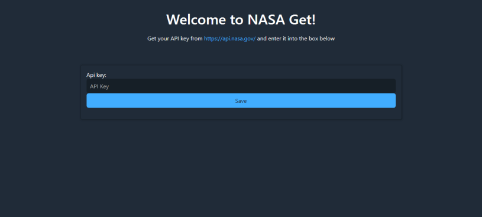

# Projects: Nasa-Get

Hello! I am Debabrata Bhattacharya. Welcome to my projects page for Nasa-Get.

Here is a link to my [portfolio page](../index.html). And here's a link back to my [projects page](../projects.html).

But first, a little about me!

## Summary

I am a **Software Engineer** with experience developing **Java, Python, Android, and JavaScript** applications. I can develop, integrate, and deploy **AWS services**. I can also train and deploy **Machine Learning models in Python**.

## Sections

- [Projects: Nasa-Get](#projects-nasa-get)
  - [Summary](#summary)
  - [Sections](#sections)
  - [Django Projects: Nasa-Get](#django-projects-nasa-get)
    - [Source Code](#source-code)
  - [Homepage Screenshot](#homepage-screenshot)
  - [Video: App in Use](#video-app-in-use)

## Django Projects: Nasa-Get

*​**Django app** that displays data collected from querying **NASA APIs**.*

View here: [Deployed on PythonAnywhere.](https://d5625.pythonanywhere.com/home/).

- Designed the app to be a no code solution to viewing latest data from NASA's public APIs.
- Simple design for a clean UX.
- Smart, auto-expiring authentication for security.
- Supports up to 4 NASA APIs.

**Technologies used: Python, Django, NASA APIs, Ridge CSS, HTML, SQLite**

### Source Code

View the source code on [GitHub here](https://github.com/D-Bhatta/Nasa-Get).

## Homepage Screenshot

Here is what the homepage looks like.

## Video: App in Use

Here is a video of the app in use.

<!-- <iframe width="1280" height="720" src="https://www.youtube.com/embed/J6E10nxC3iI" frameborder="0" allow="accelerometer; autoplay; clipboard-write; encrypted-media; gyroscope; picture-in-picture" allowfullscreen></iframe> -->
