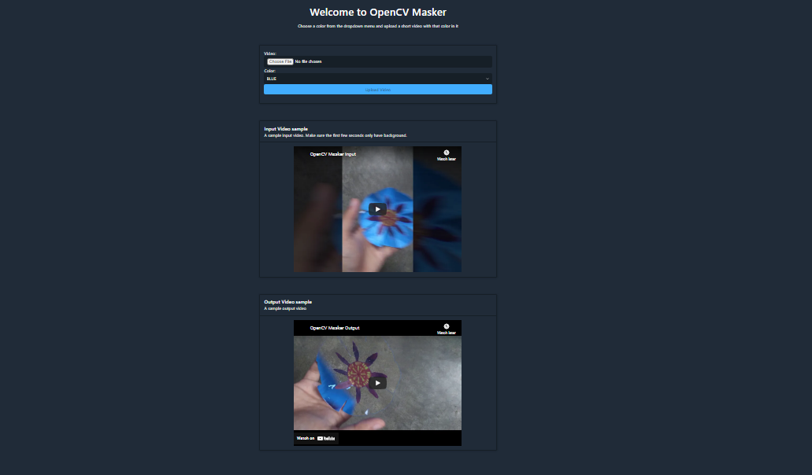

# Projects: OpenCV Masker Django

Hello! I am Debabrata Bhattacharya. Welcome to my projects page for OpenCV Masker Django.

Here is a link to my [portfolio page](../index.html). And here's a link back to my [projects page](../projects.html).

But first, a little about me!

<!-- markdownlint-disable MD036 -->

## Summary

I am a **Software Engineer** with experience developing **Java, Python, Android, and JavaScript** applications. I can develop, integrate, and deploy **AWS services**. I can also train and deploy **Machine Learning models in Python**.

## Sections

- [Projects: OpenCV Masker Django](#projects-opencv-masker-django)
  - [Summary](#summary)
  - [Sections](#sections)
  - [Django Projects: OpenCV-Masker](#django-projects-opencv-masker)
    - [Source Code](#source-code)
  - [Homepage Screenshot](#homepage-screenshot)
  - [Video: App in Use](#video-app-in-use)

## Django Projects: OpenCV-Masker

*​**Computer Vision Django app** that utilizes the OpenCV-Masker algorithm to mask colors in a video.*

View here: [Deployed on PythonAnywhere.](https://dymmy1forgames.pythonanywhere.com/masker/home/)

- The app can **render objects** of a certain color **practically invisible** in an entire video.
- Allows user to remove a color in a video and replace it with the background.
- Replicates the invisible cloak effect in Harry Potter movies.
- Core masker calss **built using OpenCV Python API**.

**Technologies used: Python, Django, OpenCV, Ridge CSS, HTML**

### Source Code

View the source code on [GitHub here](https://github.com/D-Bhatta/OpenCV-Masker-Django).

## Homepage Screenshot

Here is what the homepage looks like.

## Video: App in Use

Here is a video of the app in use.

.<!-- <iframe width="1280" height="720" src="https://www.youtube.com/embed/6Q1btFC9oo4" frameborder="0" allow="accelerometer; autoplay; clipboard-write; encrypted-media; gyroscope; picture-in-picture" allowfullscreen></iframe> -->

Here is a video of the input to the app:

.<!-- <iframe width="1280" height="720" src="https://www.youtube.com/embed/zWH5yFCHgoA" frameborder="0" allow="accelerometer; autoplay; clipboard-write; encrypted-media; gyroscope; picture-in-picture" allowfullscreen></iframe> -->

Here is a video of the output from the app:

.<!-- <iframe width="1280" height="720" src="https://www.youtube.com/embed/Br0PzOEdTY8" frameborder="0" allow="accelerometer; autoplay; clipboard-write; encrypted-media; gyroscope; picture-in-picture" allowfullscreen></iframe> -->
