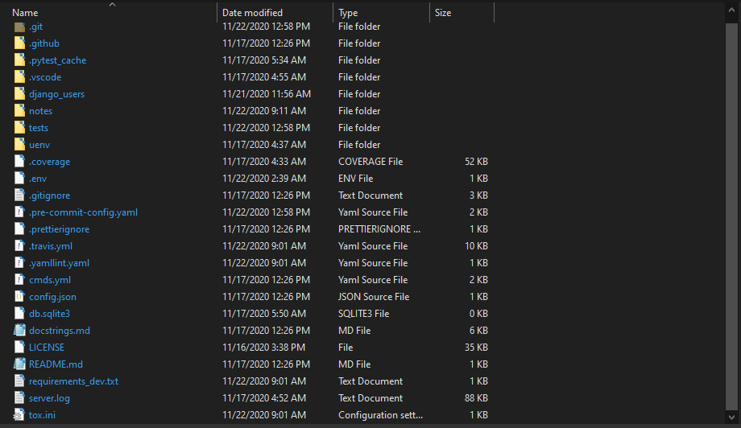

# Projects: Project-Setup

Hello! I am Debabrata Bhattacharya. Welcome to my projects page for Project-Setup.

Here is a link to my [portfolio page](../index.html). And here's a link back to my [projects page](../projects.html).

But first, a little about me!

<!-- markdownlint-disable MD036 -->

## Summary

I am a **Software Engineer** with experience developing **Java, Python, Android, and JavaScript** applications. I can develop, integrate, and deploy **AWS services**. I can also train and deploy **Machine Learning models in Python**.

## Sections

- [Projects: Project-Setup](#projects-project-setup)
  - [Summary](#summary)
  - [Sections](#sections)
  - [Python Projects: Project-Setup](#python-projects-project-setup)
    - [Source Code](#source-code)
    - [How it works](#how-it-works)
    - [Intended audience](#intended-audience)
    - [Result](#result)
    - [Sample code](#sample-code)

## Python Projects: Project-Setup

*​**Python** application that sets up a custom development environment in seconds.*

- Created functionality to store any commands in **YAML** files, which created a layer of abstraction that allows for language agnostic setup.
- Wrote tests for the entire package leading to more than 98% code coverage using **pytest**.
- Developed and documented set of commands for setting up python projects along with CI pipeline using Travis-CI, which leads to consistent local workflow across all projects of the organization.

**Technologies used: Python, YAML, Pytest**

### Source Code

View the source code on [GitHub here](https://github.com/D-Bhatta/Project-Setup/).

### How it works

The python program deploys a pre-made package with template files for easy setup. The commands file, `commands.yml` is then used to execute a series of commands that automate the setup. Logging is enabled, with logs for both input and output. *Test coverage is 98%, passing*.

[Here](https://github.com/D-Bhatta/Django-Users/blob/main/cmds.yml) is an example `commands.yml` file for [this project](https://github.com/D-Bhatta/Django-Users):

```yml
---

commands: |
    echo Hello
    git status
    git pull origin master
    git checkout -b setup
    git status
    python -m venv environment-name
    echo created environment-name
    echo. >> .gitignore
    echo # Environments >> .gitignore
    echo environment-name/ >> .gitignore
    echo # Local workspace configs >> .gitignore
    echo .vscode/ >> .gitignore
    echo. >> .gitignore
    echo # Secrets files >> .gitignore
    echo secrets.txt >> .gitignore
    git pull
    git status
    git add .gitignore
    git status
    git commit -m "Add_environment_name_to_.gitignore"
    git status
    git push origin setup
    git status
    environment-name\\Scripts\\python.exe -m pip --version
    environment-name\\Scripts\\python.exe -m pip install -r requirements_dev.txt
    ren project_name\\project_name.py new_name.py
    ren project_name new_name
    ren tests\\test_project_name.py test_new_name.py
    ren .env1 .env
    black .
    git status
    git add *
    git status
    pre-commit install
    pre-commit run --all-files
    git status
    git add *
    git status
    git commit -m "Create_files_and_run_pre-commit"
    git status
    git add *
    git status
    git commit -m "Create_files_and_run_pre-commit"
    git status
    git push origin setup
    git status

substitutions:
  - sub: django_users
    loc:
      - repo-name
  - sub: uenv
    loc:
      - environment-name
  - sub: django_users
    loc:
      - new_name

```

### Intended audience

This tool is meant to be used to quickly setup a custom development environment. Currently it sets up a single environment only, with 3 others under development.

It can be easily customised and can serve as a framework for building custom setup scripts.

### Result

Here is a screenshot of the project directory after setup:



### Sample code

Here is some sample code to help you gauge code style:

```python
"""
This file contain a class Commands.
This class is used to execute commands passed to it.

Calling it's operate method will

- Extract yaml data from a yaml file
- Substitute attributes into each command string
- Run each command string
- Log output
"""
import logging
import logging.config
import os
import shutil
import subprocess
from json import load as jload
from os import system
from subprocess import run

import yaml
from yaml import Dumper, Loader

# Configure logger lg with config for appLogger from config.json["logging"]
with open("config.json", "r") as f:
    config = jload(f)
    logging.config.dictConfig(config["logging"])
lg = logging.getLogger("appLogger")
# lg.debug("This is a debug message")


def helloworld(object):
    """
    Print a line
    args:
        object (str): name of the object
    returns:
        None
    """
    if type(object) != str:
        raise TypeError

    print("I am a {}.".format(object))


class Commands(object):
    """
    Executes a list of commands.
    """

    def __init__(self):
        self.commands = []

    def add_commands(self, command_list, losc=False):
        """
        Add a list of commands to self.commands.

        Args:
            command_list:
            (str): A string of commands seperated by spaces
            (list): A list of string commands
            losc (bool): Whether we are passing a list of string commands that
                        need to be split individually

        Returns:
            None
        """

        if not command_list:
            raise AttributeError(
                "Empty list or string passed to add_commands method"
            )

        if type(command_list) == str:
            command = command_list.split(" ")
            self.commands.append(command)
        elif losc == True:
            for base_string in command_list:
                command = base_string.split(" ")
                self.commands.append(command)
        else:
            self.commands.append(command_list)

    def delete_commands(self):
        """
        Deletes all the commands

        Args:
            None

        Returns:
            None
        """
        self.commands.clear()

    def execute_cmd(self, command):
        """
        Executes a single command and returns output.

        Args:
            command (list): A list of string commands

        Returns:
            stdout (string): Output from running the command
        """
        if not command:
            raise AttributeError("Empty command list")
        if type(command) != list:
            raise TypeError("Command should be a list")
        # run the command
        result = run(command, stdout=subprocess.PIPE, shell=True)
        # decode output from bytes to UTF-8 encoded string
        stdout = result.stdout.decode("utf-8")
        # return output
        return stdout

    def file_extract(self, file_name):
        """
        Extracts yaml strings from a file

        Args:
            file_name (string): Name of the file

        Returns:
            command_list (dict): yaml extracted from file
        """
        # Check if file name has been passed
        if not file_name:
            raise ValueError("Empty filename")
        # Check if file exists
        if not os.path.exists(f"./{file_name}"):
            raise FileNotFoundError(f"{file_name} doesn't exist")
        # check if file is a zip file
        if file_name[-4:] != ".yml":
            if file_name[-5:] != ".yaml":
                raise ValueError(
                    f"{file_name}: File extension should be yml or yaml"
                )

        with open(file_name, "r") as stream:
            yaml_object = yaml.load(stream, Loader=Loader)

        return yaml_object

    def log_output(self, command, output):
        """
        Writes output to log

        Args:
            command (string): String of command to be logged.
            output (string): String of output to be logged.

        Returns:
            None
        """
        if not command:
            raise ValueError("Empty command or output")
        if not output:  # pragma: no cover
            output = "Empty output"
        lg.info("Command:")
        lg.info(command)
        lg.info("Output:")
        lg.info(output)

    def run_commands(self):
        """
        Runs all the commands in the commands attribute of the object, and
        deletes them. Writes output to setup.log.

        Args:
            None

        Returns:
            None
        """
        if not self.commands:
            raise ValueError("Empty Command List")
        # run all the commands
        for command in self.commands:
            output = self.execute_cmd(command)
            self.log_output(command, output)

        # Clear the list of commands
        self.delete_commands()

    def substitute_values(self, command_data):
        """
        Substitutes attributes in commands at locations.

        Args:
            command_data (yaml): A yaml object that contains:
                commands (string): string commands sub and loc
                substitutions (dict): dictionary that contains
                sub (list): list of string attributes
                loc (list): list of string locations

        Returns:
            cmd_list (list): A list of string commands
        """
        if not command_data:
            raise (
                TypeError(
                    "Pass only yaml objects to substitute.Or Empty yaml object passed."
                )
            )
        elif type(command_data) != dict:
            raise (TypeError("Pass only yaml objects to substitute"))

        if not command_data["commands"]:
            raise (ValueError("Empty command list"))

        substitutions = command_data["substitutions"]
        cmd_list = []
        commands = command_data["commands"]
        content = commands
        for substitution in substitutions:
            sub_word = substitution["sub"]
            loc_len = len(substitution["loc"])
            for i in range(loc_len):
                content = content.replace(substitution["loc"][i], sub_word)

        cmd_list = content.split("\n")[:-1]
        return cmd_list

    def operate(self, file_name):  # pragma: no cover
        """
        Operates the setup

        Args:
            file_name (string): Name of the file

        Returns:
            bool :
                True if it works
                False if it doesn't
        """
        try:
            self.delete_commands()
            command_data = self.file_extract(file_name)
            commands = self.substitute_values(command_data=command_data)
            self.add_commands(commands, losc=True)
            self.run_commands()
            return True
        except Exception as e:
            lg.error(e)
            return False

cmds = Commands()
cmds.operate("cmds.yml")
```
