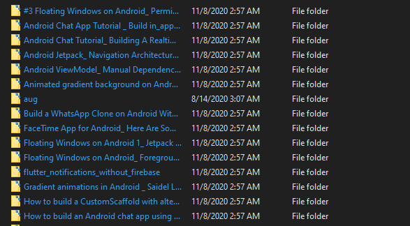

# Projects: Wget Downloader

Hello! I am Debabrata Bhattacharya. Welcome to my projects page for Wget Downloader.

Here is a link to my [portfolio page](../index.html). And here's a link back to my [projects page](../projects.html).

But first, a little about me!

<!-- markdownlint-disable MD036 -->

## Summary

I am a **Software Engineer** with experience developing **Java, Python, Android, and JavaScript** applications. I can develop, integrate, and deploy **AWS services**. I can also train and deploy **Machine Learning models in Python**.

## Sections

- [Projects: Wget Downloader](#projects-wget-downloader)
  - [Summary](#summary)
  - [Sections](#sections)
  - [Python Projects: Wget Downloader](#python-projects-wget-downloader)
    - [Source Code](#source-code)
    - [How it works](#how-it-works)
    - [Intended audience](#intended-audience)
    - [Result](#result)
    - [Sample code](#sample-code)

## Python Projects: Wget Downloader

*​**Python** application utility that downloads and archives webpages using the wget tool.*

- Designed to archive most comprehensive version of webpages.
- Added checks for network availability, presence of files, and other boundary cases
- Developed and documented set of commands for setting up and using the tool
- Designed application architecture to generate layers of abstraction so that only a file with links is required for input, simplifying archival operations.
- Downloads and stores webpages within individual folder

```powershell
Wget_downloader.py "links.txt" "names.txt"
```

**Technologies used: Python, Wget**

### Source Code

View the source code on [GitHub here](https://github.com/D-Bhatta/Wget-Downloader).

### How it works

The python program checks for boundary cases and then uses the wget tool to download web pages into separate folders.

[Here](https://github.com/D-Bhatta/Wget-Downloader#example) is an example.

### Intended audience

This tool is meant to be used to download a list of links and store them in folders from a list of folder names, purely for archival purposes.

### Result

Here is a screenshot of the directory after downloading a set of links:



The folder names are the names of the webpages, the text encapsulated inside the `title` tag. Inside each folder are all the files required to view the webpage online.

### Sample code

Here is some sample code to help you gauge code style:

```python
'''Downloads a list of links and stores them in folders from a list of folder names'''
class WgetDownloader(object):
    def __init__(self,filename1, filename2):
        self.filename1 = filename1
        self.filename2 = filename2
        self.names = []
        self.links = []
        self.queries = []
    def open_files(self):
        '''Open files and read them into lists'''

        #check if file is empty
        #
        #Define exceptions
        class Error(Exception):
            """Base class for other exceptions"""
            pass

        class FileIsEmptyError(Error):
            """Raised when file is empty"""
            pass

        #open links file and read lines into list
        print("opening links file")
        try:
            with open(self.filename1) as f:
                self.links = f.read().splitlines()
                if not self.links:
                    raise FileIsEmptyError("links.txt is empty")
                #print(self.links)
        except FileNotFoundError:
            print("file not found")
            self.exit_function(status=3)
        
        #open names file and read lines into list
        print("opening name file")
        try:
            with open(self.filename2) as f:
                self.names = f.read().splitlines()
                if not self.names:
                    raise FileIsEmptyError("names.txt is empty")
                #print(self.names)
        except FileNotFoundError:
            print("file not found")
            self.exit_function(status=3)
        


```
